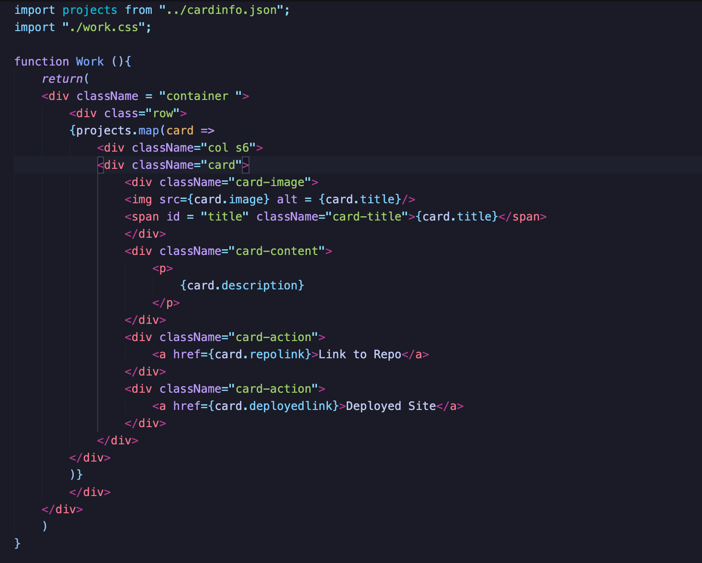

# react-portfolio

[deployed portfolio](https://nameless-castle-45341.herokuapp.com)

I created a portfolio using react and materialize that dynamically creates cards that render on my portfolio page. These cards are an example of the work that I have accomplished. 

This project helped me further familiarize myself to react, and I hope to learn more and update this portfolio after finishing more projects.

Below is a demonstration of how I used components to map out the information in a JSON file and then render them to the portfolio page.

## Table of Contents 

* [Installation](#installation)
* [Usage](#usage)
* [Credits](#credits)
* [Badges](#badges)

## Installation

The installation for this project is to go my github repositories then navigate to my portfolio or click this link [react-portfolio](https://github.com/hondahelix/react-portfolio) then click on the green code button in the top right. Then you can copy the code via ssh or by downloading a zip file.

## Usage 

 This version of my portfolio utalizes react. I want to add some more interesting features such as connecting it to a database so that people can leave comments. The project's usage is that I now have a place to display my future projects. This portfolio will continue to improve as I further learn and practice.

## Credits
Third party assets and instruction was provided by the University of California, Berkeley Full Stack Coding Bootcamp program. As well as resources utilized from and Materialize.

[UCB Coding Bootcamp](https://bootcamp.berkeley.edu/coding/)

[Materialize](https://materializecss.com)

---

## Badges

## Contact

Email: Hondahelix120@gmail.com
[linkedIn]("https://linkedin.com/in/jonathan-honda-778430153")